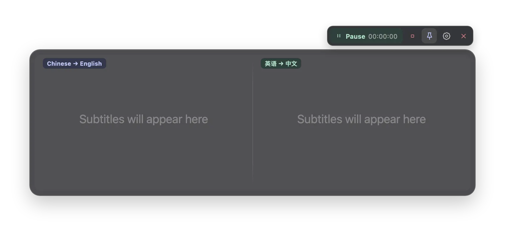
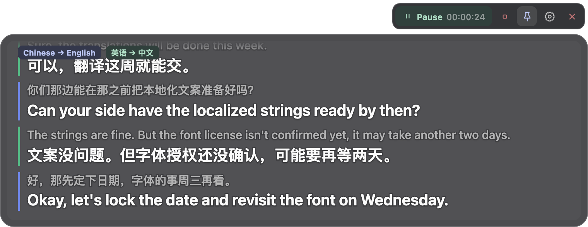
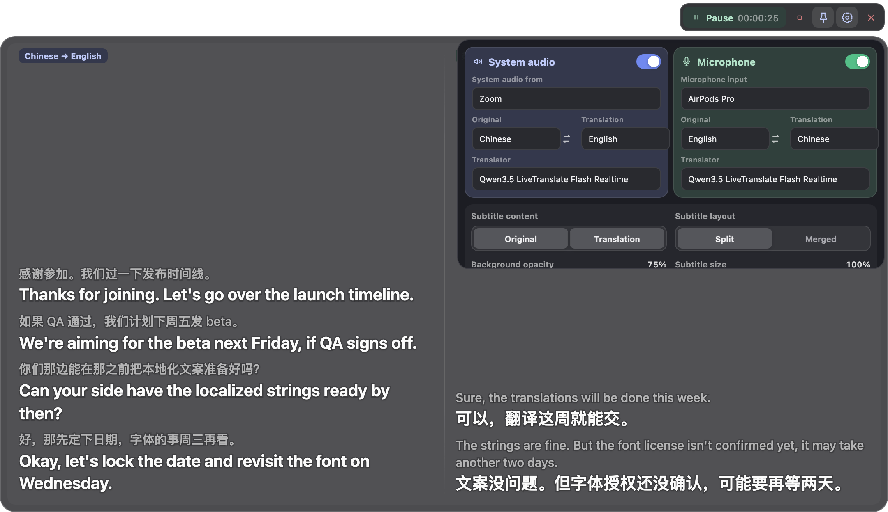
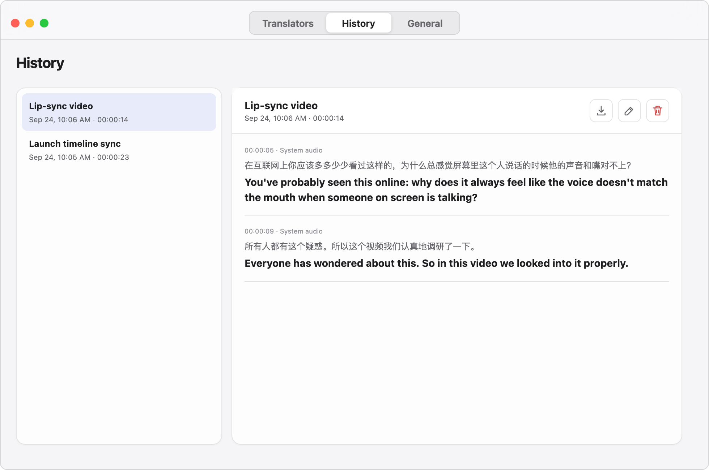
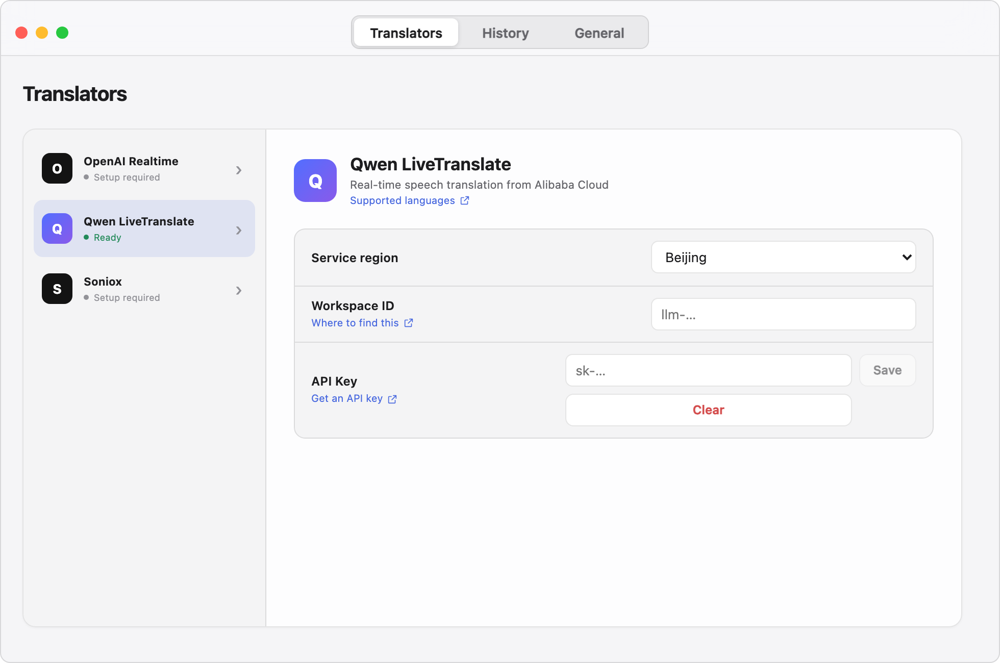

<p align="center">
  
</p>

<h1 align="center">OverLingo</h1>

<p align="center"><strong>Live two-way translation overlay.</strong></p>

<p align="center">
  English ·
  <a href="README.zh-CN.md">简体中文</a>
</p>

<p align="center">
  
</p>

Captures system audio and the microphone and shows live two-way translated subtitles. Good for videos, talks, meetings, and more.

## Download

Download the [latest release](https://github.com/Deanwfy/OverLingo/releases/latest):

- macOS 14.4+: Apple Silicon and Intel DMG
- Windows 11: x64 and ARM64 NSIS and MSI installers

On first use, macOS asks for system audio recording permission, and for microphone permission if you turn that route on.

## Highlights

- **Two routes, two tracks** — system audio and microphone, each with original and translation toggled independently
- **Per-app capture on macOS** — capture the audio of a single chosen app
- **A customizable overlay** — always on top, window size, text size, opacity, and show or hide are all adjustable
- **Subtitle history** — browse past sessions and export them
- **Your own API keys** — kept in an encrypted store on the device

## Screenshots

<table>
  <tr>
    <td width="50%"></td>
    <td width="50%"></td>
  </tr>
  <tr>
    <td align="center">Merged layout</td>
    <td align="center">Subtitle settings</td>
  </tr>
  <tr>
    <td></td>
    <td></td>
  </tr>
  <tr>
    <td align="center">History</td>
    <td align="center">Translator setup</td>
  </tr>
</table>

## Supported providers

- Alibaba Cloud Model Studio: [Qwen3.5 LiveTranslate Flash Realtime](https://www.alibabacloud.com/help/en/model-studio/qwen3-5-livetranslate-flash-realtime)
- OpenAI: [GPT Realtime Translate](https://developers.openai.com/api/docs/guides/realtime-translation)
- Soniox: [Real-time STT v5](https://soniox.com/docs/translation/stt-translation/rt-translation)

## Privacy

Audio is sent only to the selected provider, and subtitle history stays on the device. API keys are stored in macOS Keychain or Windows Credential Manager. OverLingo has no account system, telemetry, analytics, or relay server.

## Build from source

Requires Rust 1.88 or later, Node.js 24 LTS, and the native macOS or Windows toolchain.

```bash
npm ci
npm test
npm run dev
```

On macOS, `export APPLE_SIGNING_IDENTITY="Apple Development: Your Name (TEAMID1234)"` signs dev builds.

Release bundles:

```bash
# macOS
npm run build:macos:x64
npm run build:macos:arm64

# Windows
npm run build:windows:x64
npm run build:windows:arm64
```

macOS builds create an app bundle and DMG; Windows builds create NSIS and MSI installers.

## Acknowledgements

OverLingo is based on [My Translator](https://github.com/phuc-nt/my-translator) by [Trọng Phúc](https://github.com/phuc-nt) and its contributors. See [NOTICE.md](NOTICE.md) and [THIRD_PARTY_LICENSES.md](THIRD_PARTY_LICENSES.md) for attribution and bundled license notices.

## License

[MIT](LICENSE)
