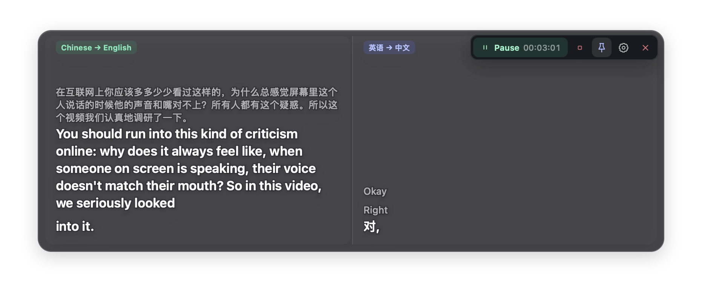

<p align="center">
  
</p>

<h1 align="center">OverLingo</h1>

<p align="center"><strong>为任意应用叠加实时双语字幕。</strong></p>

<p align="center">
  <a href="README.md">English</a> ·
  简体中文
</p>

<p align="center">
  
</p>

OverLingo 把系统音频和麦克风里的语音，实时转成双语字幕，显示在一个小巧的桌面悬浮窗里。两条链路可以单独使用，也可以同时开启，适合看视频、听演讲、开多语言会议等场景。

## 下载

前往[最新版本](https://github.com/Deanwfy/OverLingo/releases/latest)下载：

- macOS 14.4 及以上：Apple Silicon 与 Intel 版 DMG
- Windows 11：x64 与 ARM64 版 NSIS 和 MSI 安装包

首次使用时，macOS 会请求系统音频录制权限；如果开启麦克风链路，还会请求麦克风权限。

## 功能

- **双路音频** —— 系统音频、麦克风，可同时开启
- **双路字幕** —— 双路音频字幕可同时显示，原文、译文可自由开启
- **macOS 单应用捕获** —— macOS 支持仅捕获指定应用音频
- **自定义悬浮窗** —— 置顶、尺寸、文字大小、透明度、显示/隐藏，均可自定义
- **历史字幕** —— 可查看历史字幕，支持导出
- **使用您自己的密钥** —— 密钥会被安全地保存在本地加密位置

## 支持的服务商

- 阿里云百炼：[Qwen3.5 LiveTranslate Flash Realtime](https://help.aliyun.com/zh/model-studio/qwen3-5-livetranslate-flash-realtime)
- OpenAI：[GPT Realtime Translate](https://developers.openai.com/api/docs/guides/realtime-translation)
- Soniox：[Real-time STT v5](https://soniox.com/docs/translation/stt-translation/rt-translation)

## 隐私

音频只会发送给选定的服务商，字幕历史始终保留在本机。API Key 保存在 macOS 钥匙串或 Windows 凭据管理器中。OverLingo 没有账号体系，也没有遥测、统计分析或中转服务器。

## 从源码构建

需要 Rust 1.88 及以上、Node.js 24 LTS，以及 macOS 或 Windows 的原生工具链。

```bash
npm ci
npm test
npm run dev
```

构建发布包：

```bash
# macOS
npm run build:macos:x64
npm run build:macos:arm64

# Windows
npm run build:windows:x64
npm run build:windows:arm64
```

macOS 构建生成 app 包和 DMG，Windows 构建生成 NSIS 和 MSI 安装包。

## 致谢

OverLingo 基于 [Trọng Phúc](https://github.com/phuc-nt) 及其贡献者的 [My Translator](https://github.com/phuc-nt/my-translator) 开发。署名信息和随附的许可证声明见 [NOTICE.md](NOTICE.md) 与 [THIRD_PARTY_LICENSES.md](THIRD_PARTY_LICENSES.md)。

## 许可证

[MIT](LICENSE)
